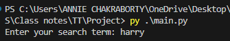
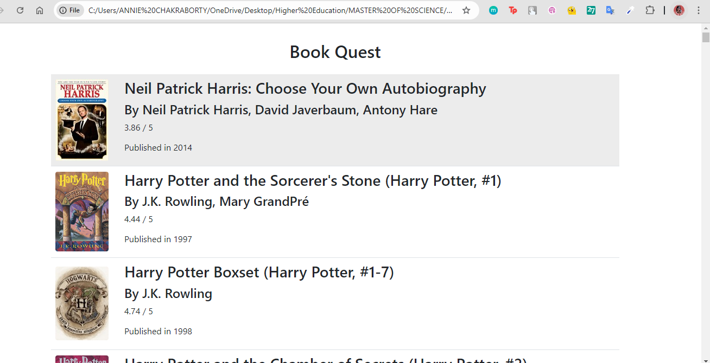
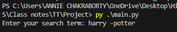
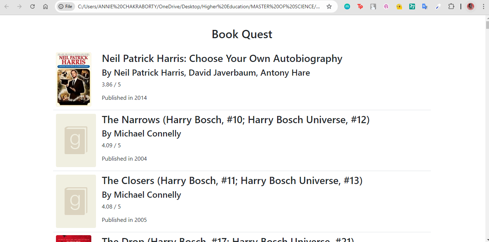
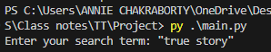
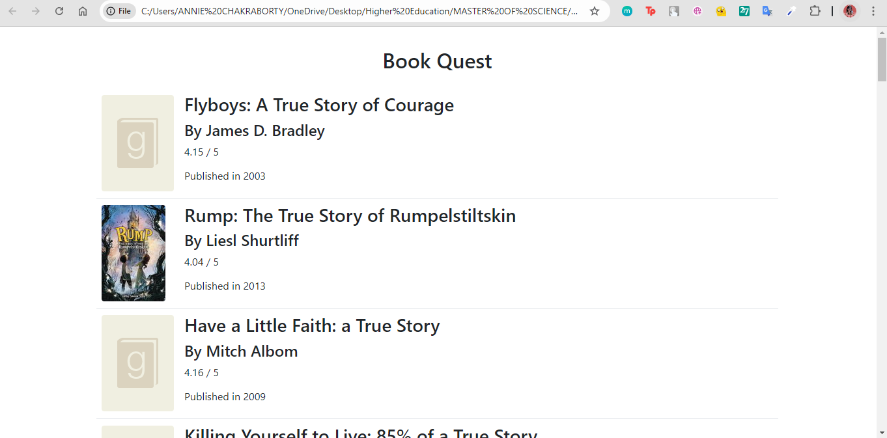

# Book Quest 

### About
The "Book Quest" project aims to streamline and enhance the process of book discovery for users by leveraging the capabilities of popular NoSQL database **MongoDB's Full-Text Search**. It focuses on developing an efficient book searching web application. The core objective is to improve search efficiency, query complexity, and response speed, ensuring relevant results for the users.

In this project, we deep dive into the capabilities of MongoDB's Full Text Search and how it fares against popular SQL database **PostgreSQL** by comparing the effiency of query execution and the complexity of query searches supported by both.

✨ Keywords  :SQL, NoSQL, Full Text Search, query optimisation

### Pre-requisities
- Ensure that Python v3 and Pip are installed on the system. Run the following commands in the terminal to check the installed versions:  
`python --version`  
`pip --version`  
If the commands throw an error, then please install Python by following the official documentation. Python version 3.4 and above automatically installs pip. For our project we have used the Python v3.10.5 and pip v24.0
- Add Python and Pip to the environment PATH variable.  
	`C:\Users\<user name>\AppData\Local\Programs\Python\Python310\Scripts\`  
  `C:\Users\<user name>\AppData\Local\Programs\Python\Python310\`
- Execute the following command to install the third party packages that need to be installed to run the program.  
  `pip install dicttoxml pymongo bson lxml`
- Install Mongo Compass on your system by following the official documentation here. Add mongo to the environment variable PATH here:  
  `C:\Program Files\MongoDB\Server\6.0\bin`

### Getting Started
- Initially, create a database in Mongo by launching the MongoDB Compass and connecting to the server. In our case we connect to the local server (local host) using the `mongodb://localhost:27017` connection string URI.
- Create a new database called BookFinder with a collection called Books.
- Clone / download this project and open it in the Command Prompt / Terminal of your device and run the command `py .\main.py`
- To run the PostgreSQL implmentation, run `py .\postgreSQL_implmentation.py`

### Project File Structure

| File / Folder name      | Purpose      |
| ------------- | ------------- |
| main.py | The python file that drives the whole logic of the project |
| output.xml | The XML file created by converting the query response to XML data. |
| books.dtd | The DTD grammar against which we check our generated XML file |
| newtransform.xslt | This is the XSLT stylesheet that is used to transform the XML to HTML |
| newtransformed_output.html | The HTMl file which is generated as the final output to the search query |

### Data Model

We  sourced our dataset from Kaggle's GoodBooks-10k dataset which is composed of several CSV files, each containing specific types of information about the books and their interactions on the GoodReads platform. The primary file included in the dataset is books.csv that contains detailed metadata for each of the 10,000 books. We extract the essential attributes to work with and the rest of the fields were discarded. The basic structure of the dictionary is as follows.   
“book_id” : {   
 &emsp; title: book-name,   
 &emsp; author: author-name,   
 &emsp; publication_year: year,   
 &emsp; average_rating: rating,   
 &emsp; image_url: url	  
}   

Every row is read and converted into the above key-value pair after the following checks are implemented.
- If the book_id, title or authors are missing, then we ignore / skip that row.
- In the case of null values in publication_year and average_ratings, use default values of 2000 and 3 respectively.

### Sample Queries

Query 1: Basic search- User enters a simple search term “harry”    
     

Output HTML   
     

Query 2: Keywords exclusion - User excludes the term “potter” from the search   
     

Output HTML   
     

Query 3: Phrase search - User searches with phrase “true story”   
     

Output HTML   
     

## Alternative implementations
Here I have prepared a report where I discuss the potential of using PostegreSQL (an SQL database) over MongoDB (a NoSQL database). I discuss the properties, advantages and disadvantages of each and the steps of implementation. The python implementation is provided in the postgreSQL_implmentation.py file and can be executed by running `py postgreSQL_implmentation.py`  
[Link to the report can be found here](https://medium.com/@annie.chakraborty/book-quest-contrasting-two-different-database-implementations-in-a-book-query-project-4605d5208784)
